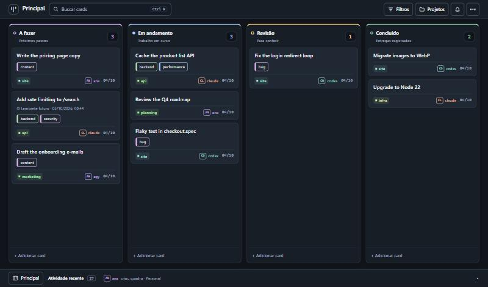

# agent-board

**English** · [Português](README.pt-BR.md)

A Kanban board that AI agents operate through **MCP**, with a web interface for the human.

When several AI sessions work on the same projects, each one starts from zero. None of them knows what the others did, what is in progress, or why a decision was made. This board is the shared state: you drag cards in the browser, and Claude Code, Codex and other agents read and write the same cards through MCP, a REST API or a small CLI. **Every change is recorded with its author**, so opening a card shows which session did what.



> The interface, the API routes and the MCP tool names are in Portuguese. The code is small and the tool descriptions are self-explanatory to an AI agent, but translations are welcome: see [CONTRIBUTING.md](CONTRIBUTING.md).

## What it does

- **Kanban with authorship.** Columns, drag and drop, comments, and a per-card history that says who did each thing.
- **For agents.** 30+ MCP tools over HTTP, a REST API, and a dependency-free CLI. All three share one core, so they cannot drift apart.
- **Finding things.** Search across titles, descriptions, comments and tags (Ctrl+K), combinable filters kept in the URL, tags, and a project list with counts.
- **Several boards**, each with its own columns.
- **Reminders and recurring tasks.** Agents can ask for "reminders due today" when a session starts.
- **Safe to operate.** Archive instead of delete, undo (Ctrl+Z), and optimistic locking so two sessions do not overwrite each other.
- **Three themes** (dark, light, glass) and wallpapers stored on the server.
- **Small.** SQLite in a single file, no external services, few dependencies.

## Quick start

Requires Node.js 20 or newer. `better-sqlite3` compiles native code on install; on Linux you may need `build-essential` and `python3`.

```bash
git clone https://github.com/Slayer1Dev/agent-board.git
cd agent-board

# Terminal 1: API and MCP on http://127.0.0.1:8078
cd server && npm install && npm run dev

# Terminal 2: interface on http://localhost:5174
cd web && npm install && npm run dev
```

Or with Docker (publishes both ports on localhost only):

```bash
docker compose up --build
```

## Connecting an agent

**MCP** (Claude Code shown; any MCP client over HTTP works):

```bash
claude mcp add --scope user --transport http agent-board http://127.0.0.1:8078/mcp
# with a key:  --header "Authorization: Bearer YOUR_KEY"
```

**CLI**, for agents without MCP or for your own terminal:

```bash
export AGENT_BOARD_URL=http://127.0.0.1:8078/api
export AGENT_BOARD_AUTHOR=claude

node cli/agent-board.mjs ver
node cli/agent-board.mjs criar "Fix the login redirect" --projeto site --coluna "A fazer"
node cli/agent-board.mjs mover 1a2b3c4d "Em andamento"
node cli/agent-board.mjs comentar 1a2b3c4d "Root cause was the cookie domain."
node cli/agent-board.mjs buscar "cookie"
```

A ready-made instruction file for Claude Code is in [integrations/claude-code-skill](integrations/claude-code-skill/SKILL.md). Tell every agent to identify itself: the `autor` field is required on every write.

The full list of routes and tools, with an example for each, is in [docs/API.md](docs/API.md).

## Configuration

| Variable | Default | Purpose |
|---|---|---|
| `BOARD_DB` | `~/.agent-board/board.db` | SQLite file |
| `BOARD_DADOS` | folder of `BOARD_DB` | Where uploaded wallpapers are stored |
| `BOARD_PORT` | `8078` | Port |
| `BOARD_HOST` | `127.0.0.1` | Network interface to listen on |
| `BOARD_API_KEY` | *(empty)* | When set, every request needs `Authorization: Bearer <key>` |
| `BOARD_HOSTS` | *(empty)* | Extra host names accepted when there is no key (comma separated) |
| `BOARD_CORS_ORIGENS` | *(empty)* | Browser origins allowed to call the API from another address |
| `BOARD_PERMITIR_ABERTO` | *(empty)* | `1` lets the server listen outside localhost without a key |
| `BOARD_FUSO` | `America/Sao_Paulo` | Time zone used to decide whether a reminder is "today" |

## Security model

This is a personal tool, and its defaults assume a single machine.

- **Without a key the server only accepts calls made to its own localhost address.** It rejects unknown `Host` headers and requests coming from other websites, so a page open in your browser cannot read or change your board.
- **To reach it from other machines, set `BOARD_API_KEY`.** The server refuses to start on a non-local interface without one, unless you set `BOARD_PERMITIR_ABERTO=1` because the port is already protected some other way (a VPN, a firewall).
- **Do not put the key in the web build.** Serve the interface through a proxy that adds the header: [web/vite.proxy.example.mjs](web/vite.proxy.example.mjs) does exactly that.
- **`autor` is declared, not verified.** It is a history, not access control. Anyone with access to the API can write under any name.

See [SECURITY.md](SECURITY.md) to report a vulnerability.

## How it is built

```
  web interface ──┐
  CLI ────────────┼──►  REST API ─┐
  Claude / Codex ─┴──►  MCP ──────┴──►  core (nucleo.ts)  ──►  SQLite
                                              │
                                    history with authorship
```

- **One core.** `server/src/nucleo.ts` holds all the rules; REST and MCP are thin layers over it.
- **SQLite**, not Postgres: one file, backup with `cp`, nothing to keep running.
- **Stateless MCP.** Each request creates its own transport; there is no session to expire.
- **Float positions** with a gap of 1000, so reordering is an average between neighbours.
- **Native HTML5 drag and drop**, no library.
- **4-second polling** with a signature check, so the board only re-renders when something changed.

## Known limitations

- Polling, not WebSocket: a change made by another session appears within 4 seconds.
- No user accounts. See the security model above.
- Interface and API names are in Portuguese only.
- Reminders are shown in the board and available to agents; nothing is pushed to phone or e-mail.

## Contributing

Issues and pull requests are welcome. Read [CONTRIBUTING.md](CONTRIBUTING.md) first; if you work with an AI agent, point it to [AGENTS.md](AGENTS.md).

## License

[MIT](LICENSE)
